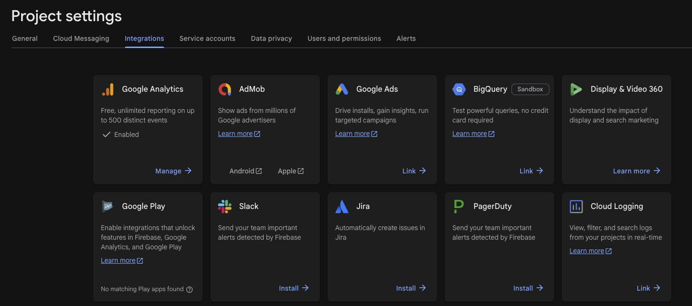
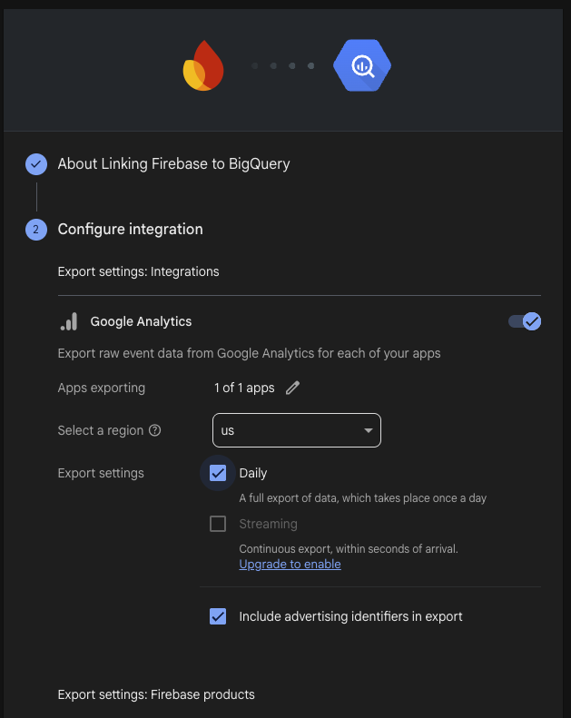
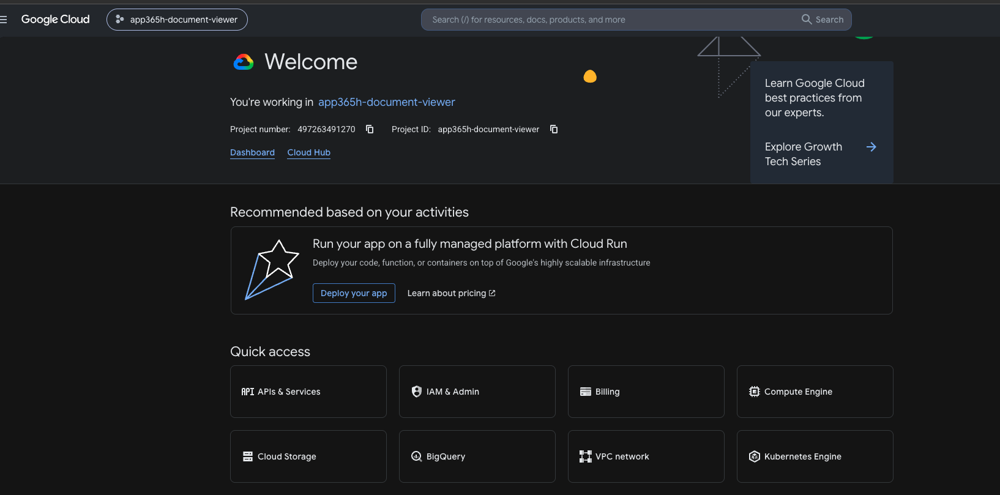
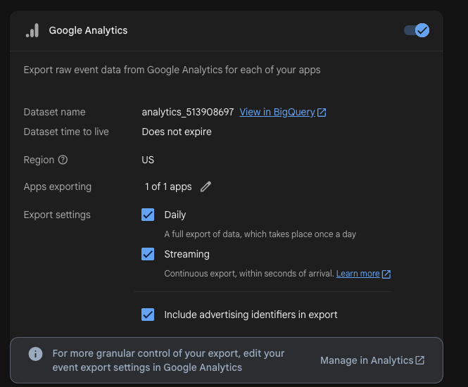
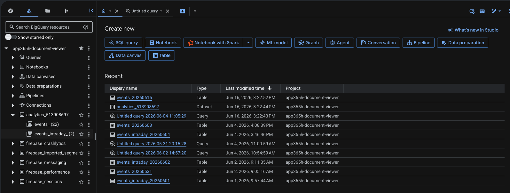
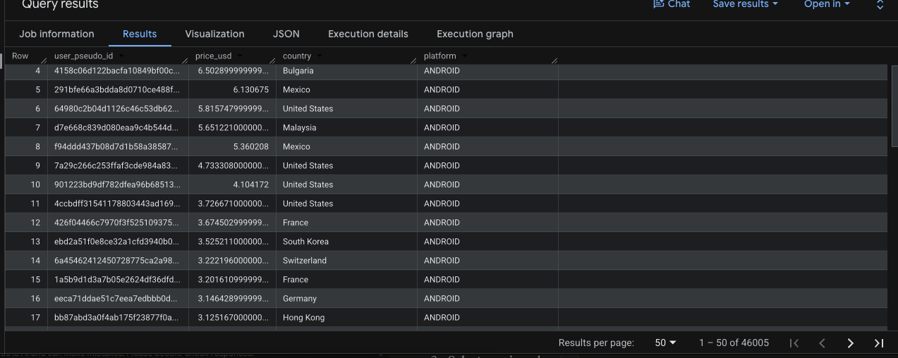

# Hướng dẫn Setup BigQuery để Query Data

## 1. Tích hợp log doanh thu quảng cáo trong app (Flutter)

1. Thêm file **`ad_revenue_logger.dart`** vào source của app (ví dụ trong thư mục `lib/`).
2. Khởi tạo (init) logger trong **`app.dart`** bằng cách gọi:

```dart
AdRevenueLogger.instance.start();
```

> Gọi `start()` một lần khi app khởi động (ví dụ trong `initState()` của widget gốc hoặc sau khi Firebase đã `initializeApp`). Sau khi chạy, dữ liệu ad revenue sẽ được log qua Analytics và export sang BigQuery theo cấu hình ở Mục 3.

=> Release 1 bản mới này lên store

## 2. Liên kết Firebase với BigQuery

1. Vào **Firebase Project Settings** của dự án.
2. Chọn tab **Integrations**.
3. Tại thẻ **BigQuery**, bấm **Link** để liên kết.

> ⚠️ Thao tác này **yêu cầu quyền Owner**. Nếu chưa có quyền, xin **anh Trường** cấp quyền.



## 3. Bật cấu hình export (Configure integration)

Sau khi liên kết, vào bước **Configure integration** và bật cấu hình như ảnh dưới:

1. Bật (enable) **Google Analytics**.
2. **Select a region:** chọn `us`.
3. **Export settings:** tick **Daily** (export toàn bộ data 1 lần/ngày).
4. Tick **Include advertising identifiers in export** nếu cần.

> ⚠️ **Streaming (dữ liệu thực / realtime):** ô **Streaming** đang bị khoá, cần **Upgrade**. Muốn bật được phải **add billing account** vào project — báo **anh Văn** để add billing account thì mới enable được.



## 4. Truy cập BigQuery để query data

**Cách 1 — Từ Google Cloud Console:**

1. Vào **Google Cloud Console**: https://console.cloud.google.com
2. Ở góc trên, chọn đúng **Project** của dự án (ví dụ `app365h-document-viewer`).
3. Tại mục **Quick access** (hoặc menu bên trái) hoặc tab dưới, bấm vào **BigQuery** để mở giao diện query.



**Cách 2 — Từ Firebase:** Khi đã có bảng data Analytics, trong màn **Configure integration** (thẻ Google Analytics) bấm link **View in BigQuery** bên cạnh `Dataset name` để mở thẳng dataset trong BigQuery.



> ⏱️ **Thời gian chờ data nếu lần đâu phải đợi 24h tạo data set về BigQuery:**
> - Sau đó nếu có data set -> Nếu **bật Streaming**: dữ liệu về sau khoảng **30 phút – 1 giờ**.
> - Nếu **chỉ bật Daily** (không Streaming): phải chờ **24 – 48 giờ** mới có bảng dữ liệu của ngày đó.

## 5. Giao diện BigQuery khi đã có dữ liệu Analytics

Sau khi Firebase export thành công, trong panel **Explorer** (bên trái) sẽ thấy các dataset/bảng như hình:

- Dataset **`analytics_<property_id>`** (ví dụ `analytics_513908697`) chứa:
  - **`events_`** — bảng dữ liệu hằng ngày (`events_YYYYMMDD`), dùng để query chính.
  - **`events_intraday_`** — bảng dữ liệu trong ngày hiện tại (nếu có bật).
- Các dataset khác từ Firebase: `firebase_crashlytics`, `firebase_messaging`, `firebase_performance`, `firebase_sessions`...

Mở tab **SQL query** để bắt đầu query trên các bảng này.



## 6. Mở SQL để viết truy vấn

Bấm **SQL query** để mở editor và viết câu truy vấn.

> Việc viết câu SQL **phụ thuộc vào yêu cầu cụ thể từ bên Marketing (MKT)** — họ cần xem chỉ số/dữ liệu gì thì viết query tương ứng. Bạn có thể **nhờ AI viết hộ** câu lệnh dựa trên yêu cầu đó (mô tả rõ cần lấy gì, lọc theo điều kiện nào).

Ví dụ một câu truy vấn mẫu (tính doanh thu ad theo user trong 3 ngày đầu kể từ `first_open`):

```googlesql
WITH first_open_users AS (
  SELECT
    user_pseudo_id,
    MIN(PARSE_DATE('%Y%m%d', event_date)) AS first_open_date,
    ARRAY_AGG(geo.country ORDER BY event_timestamp LIMIT 1)[OFFSET(0)] AS country,
    ARRAY_AGG(UPPER(platform) ORDER BY event_timestamp LIMIT 1)[OFFSET(0)] AS platform
  FROM `app365h-document-viewer.analytics_513908697.events_*`
  WHERE event_name = 'first_open'
    AND _TABLE_SUFFIX NOT LIKE 'intraday%'
    -- AND _TABLE_SUFFIX BETWEEN '20250101' AND '20251231'  -- giới hạn ngày để giảm cost
  GROUP BY user_pseudo_id
)

SELECT
  f.user_pseudo_id,
  SUM(
    COALESCE(
      ep.value.double_value,
      ep.value.float_value,                                   -- đã là FLOAT64, không cần CAST
      CAST(ep.value.int_value AS FLOAT64),
      SAFE_CAST(REPLACE(ep.value.string_value, ',', '.') AS FLOAT64),
      0.0
    )
  ) AS price_usd,
  f.country,
  f.platform
FROM `app365h-document-viewer.analytics_513908697.events_*` e
JOIN first_open_users f
  ON e.user_pseudo_id = f.user_pseudo_id
CROSS JOIN UNNEST(e.event_params) ep
WHERE
  e.event_name = 'paid_ad_impression'
  AND ep.key = 'value'
  AND e._TABLE_SUFFIX NOT LIKE 'intraday%'
  AND PARSE_DATE('%Y%m%d', e.event_date)
      BETWEEN f.first_open_date AND DATE_ADD(f.first_open_date, INTERVAL 2 DAY)
GROUP BY f.user_pseudo_id, f.country, f.platform
HAVING price_usd > 0
ORDER BY price_usd DESC;
```

> 📝 **Lưu ý:** thay `app365h-document-viewer.analytics_513908697` bằng **project và dataset/bảng của dự án hiện tại** của bạn. Bỏ comment dòng `_TABLE_SUFFIX BETWEEN ...` để giới hạn khoảng ngày, giúp giảm chi phí query.

Bấm **Run** (`Ctrl/Cmd + Enter`). Sau khi chạy xong, kết quả sẽ hiển thị ở phần **Query results** như hình dưới:



## 7. Lưu kết quả (Save results)

Sau khi có kết quả, bấm **Save results** ở phía trên bảng kết quả và chọn định dạng muốn xuất:

- **CSV** (tải về máy hoặc lưu Google Drive)
- **Google Sheets**
- **BigQuery table** (lưu thành bảng mới để dùng lại)
- **JSON** / **Copy to clipboard**

Chọn định dạng phù hợp với nhu cầu (ví dụ CSV/Google Sheets để chia sẻ, BigQuery table để query tiếp).

